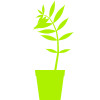
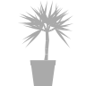

# 🌿 SvgPlant




A library that lets you generate images of different types of plants as svg elements.

<a href="https://htmlpreview.github.io/?https://github.com/days-later/svg-plant/blob/main/demo/demo.html" target="_blank">Demo</a>

## Install

Install with npm:

```bash
npm install --save svg-plant
```

Load with script tag:

```html
<script src="https://unpkg.com/svg-plant@1.0.0/dist/svg-plant.min.umd.js"></script>
```

## Usage

```js
import { SvgPlant, ZamiaGenus } from 'svg-plant';

// Choose a seed - as long as you use the same seed, the plant will always come out the same.
// If you dont supply a seed, a random value will be used.
const seed = 12;
const genus = new ZamiaGenus( seed );
const plant = new SvgPlant( genus );

const svg = plant.svgElement;
document.body.appendChild( svg );
```

If you used the script tag to include the library, a global `SvgPlant` object is exposed:

```html
<script type="text/javascript">
    var seed = 12;
    var genus = new SvgPlant.ZamiaGenus( seed );
    var plant = new SvgPlant.SvgPlant( genus );

    var svg = plant.svgElement;
    document.body.appendChild( svg );
</script>
```

## Genera

This library calls the different types of plants "Genera."
You can import a map of all available genera:

```js
import { Genera } from 'svg-plant';

for (let name in Genera) console.log( name, Genera[ name ] );
// "BushyPlant", BushyPlantGenus
// "DragonTree", DragonTreeGenus
// "Zamia", ZamiaGenus
// "Pilea", PileaGenus
```

If you only need specific genera, its better to only import those:

```js
import { BushyPlantGenus, ZamiaGenus } from 'svg-plant';
```

## Configuration

```js
import { SvgPlant, ZamiaGenus } from 'svg-plant';


const genus = new ZamiaGenus();
const cfg = {
    color: true,    // Boolean
    age: 1,         // Float [0,1]
    potSize: .3,    // Float [0,1]
    potPathAttr: {  // Object
        fill: '#fc7',
        stroke: '#da5'
    },
};
const plant = new SvgPlant( genus, cfg );

const svg = plant.svgElement;
document.body.appendChild( svg );

// Changing settings updates "plant.svgElement.innerHTML."
// So in this case it will also update the svg rendered in the browser.
plant.color = false;
plant.age = .5;
plant.potSize = 0;
plant.potPathAttr = {
    fill: '#FF5DA9',
    stroke: '#D1234C'
};

// This will not update the svg element though.
plant.potPathAttr['stroke-width'] = 3;

// You will need to trigger the update yourself: (in this case only the pot would need an update)
plant.update( false, true );    // updates only the pot
plant.update( true, false );    // updates only the plant
plant.update();                 // updates both
```

### color
Boolean, Default: true

Wether the svg includes fill / stroke style attributes.
`potPathAttr` will only be used if color is enabled.
If color is disabled, branches and leaves will each be rendered as a single path element.
Without color the plant looks like a silhouette and you can use css to give it a solid color:

```css
svg.svg-plant {
    fill: #eb244c;
}
```

### age
Float [0,1], Default: 1

Age 0 means "Plant has not started to grow."
Age 1 means "Plant is fully grown."
All values in between represent a growth stage, eg. .5 - half grown.

### potSize
Float [0,1], Default: .3

The height of the pot in relation to the available height.
Eg. .3 means 30% of the available height is taken up by the pot, and 70% by the plant.
0 means no pot will be rendered, 1 means no plant will be rendered.

### potPathAttr
Object, Default: { fill: '#fc7', stroke: '#da5' }

Each property of this object will be applied to the pot path via Element.setAttribute( key, value ).
Can contain any valid &lt;path/> attributes. It is best to use this setting to set a the "stroke-width" attribute.
Because stroke-width will be taken into account to determine the size of the pot to avoid clipping.
If no stroke-width is supplied, 2 will be set. This setting is only used if `color` is enabled.

# Animation

Todo

# Custom Genera

Todo
